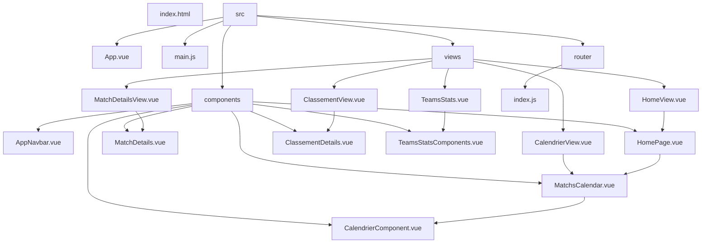

# 🌐 Language Switcher

[Français](#description-du-projet) | [English](#project-description)

# Description du projet

Notre projet est un site internet regroupant les matchs, le calendrier, le classement et les statistiques d'équipes de la Ligue nationale suisse de hockey sur glace. Notre but était de créer un site ayant une architecture visuelle moderne, un contenu dynamique et à jour, ainsi qu'une prise en main facile.

## 🚀 De l'idée à la réalisation

### ✅ Ce qui a fonctionné

#### 📚 Vue

Nous avions quelques appréhensions pour la structure générale du projet car tout n'était pas très clair sur la structure de base d'un projet vue. Nous avons donc pris le temps de lire la documentation et de visionner des tutoriels. L'initialisation du projet s'est faite sans problème et la structure également. Au final, nous sommes satisfaits du résultat de notre projet et avons bien compris le fonctionnement de Vue.

#### 🌐 Git / Github

Nous avions aussi quelques doutes sur l'utilistion de Git car le cours sur ce système datait du semestre passé. Finalement son utilisation est devenue un point fort, cela nous a permis de revoir des versions et de travailler de manière autonome. L'utilisation de Git dans ce projet nous a permis d'apprendre à collaborer à deux sur un seul projet et à mieux comprendre le fonctionnement de Git.

#### 🤝 Travailler en équipe

Travailler en équipe de 2 avec Github nous a simplifié la vie, il permettait de voir l'avancement du projet, de créer de nouvelles branches pour tester des fonctionnalités sans affecter le travail de l'autre, et de pouvoir compléter nos travaux. Nous avons pu également nous entre-aider lorsque l'un de nous était bloqué sur une fonctionnalité ou sur le développement d'un bout de code. Notre collaboration a été un point fort dans l'aboutissement de ce projet.

### ❌ Ce qui a posé problème

#### 🔄 Les API

Nous avons mis beaucoup de temps à pouvoir trouver une API viable pour le projet et sans frais, car la majorité des API que nous avons trouvée demandait un paiement ou n'était tout simplement pas accessible publiquement. L'idée de base était que nous voulions avoir les calendriers des matchs, le classement et les statistiques des équipes et des joueurs. Le problème était que toutes les API liées aux statistiques des joueurs étaient payantes, nous avons donc décidé de supprimer certaines fonctionnalités dès le début du projet.

-   🌐 **L'API** (https://api-sports.io/documentation/hockey/v1)
    -   Le premier problème posé par l'API était de comprendre son fonctionnement et les données qu'elle pouvait nous retourner. Elle proposait beaucoup de données des équipes du monde entier et le filtre des données n'était au début pas si évident.
    -   Le second problème était qu'il fallait limiter le nombre d'appels vers l'API, il fallait donc une mise en cache avec une notion de temps de vieillissement des données. Au début, chaque rafraichissement de la page envoyait une requête à l'API et nous nous retrouvions rapidement à cours de requêtes possibles. Nous avons donc développé une mise en cache des données.
    -   Le dernier problème rencontré, était plus de l'esthétique. Les noms des équipes retournés étaient mixés entre l'allemand et le français et il n'y avait pas un formatage donné par l'API. Nous avons donc créé notre propre méthode, avec le format désiré pour que le nom des équipes soit cohérent en fonction de la langue.

#### 🔧 Aspect technique

Une de nos plus grosses difficultés a été l'affichage du calendrier et des détails des matchs. Nous avons rencontré beaucoup de problème lors de la phase de développement car les quotas de l'API était très vite atteints. C'est lors de cette phase que nous avons pu comprendre comment fonctionnaient la mise en cache et les routes. En effet, avec la mise en cache des données, la mise à jour des matchs était impossible : la mise en cache des données reçues depuis l'API empêchait la mise à jour des matchs à afficher en fonction de la date, puisque les requêtes pour obtenir les données étaient actualisées qu'au bout d'un certain temps, ceci afin de limiter les requêtes à l'API. Il a donc fallu modifier nos méthodes pour que le changement de date dans le calendrier puisse effectivement fonctionner et que nos méthodes fassent de nouvelles requêtes à chaque changement de date. Une fois ce problème compris et réglé, le développement a été bien plus aisé et nous avons pu atteindre nos objectifs.

Pour le classement, le plus gros problème a été de comprendre comment étaient retournées les informations de l'API et comment les afficher sur notre site. Nous avons également eu des difficultés pour mettre en place la possibilité de personnalisation de la navbar. Il nous a fallu quelques temps pour trouver comment mettre à jour la navbar en temps réel tout en enregistrant dans le Localstorage le logo choisi par l'utilisateur.

### 🎓 Principales leçons apprises

-  📖 Lire la doc, étant débutant intermédiaire, nous n'avons pas toujours eu les réflexes de consulter directement la documentation, mais grâce à ce projet, nous avons appris que la lire dès le début peut nous faire gagner du temps. La visualisation de tutoriels a également aidé à comprendre le fonctionnement de Vue.
-  🌐 Git / GitHub, nous avons pu utiliser de manière concrète les outils Git.
-   🐞Les bugs, traitement des bugs directement, ne pas attendre de miracle.

# 🗂️ Schéma de l'architecture

## Structure du site

<!-- https://mermaid-js.github.io/mermaid-live-editor/edit#pako:eNpdkstywjAMRX8l4zXkA1h0BhLeEJ7Tjd2FmqjEre1kbIe2w_DvNU4bQ3dHV5orWdaF5FWBZEBOGuoyOqZMMTWkXBX4FZdWipebMKJG554SOqzr-Nygj1Iqgav43fhoTPNK1pVCZVthQs8cP1ueUl01FrUPZjeXDM6voDuvOZ1VErdwQtFpC7oGm5cpWuDCdPKSJiBQFZqjfnYdusSKJgKMQelGeEisvfmDlAVvwc1DakOPCNIcLFjz97htW27azndz7-56_h90fzdo0u2mS4-ifv8pSgKmAccBJwGnfs8eZwHnARd-7x6XAVcB1wEz_y8eN8FhG3AXcE96RKJ23124Y7kwFUWM2NK9mpGBQ7eRD0aYuro6aGx1-FY5GbyBMNgjTV2AxZSDOzL5q15_AFxh208-->

# 🖼️ Croquis du prototype initial

# 🌐 API

-   EliteProspect : https://www.eliteprospects.com/api
-   RapidAPI : https://rapidapi.com/api-sports/api/api-hockey/
-   NHL API (github) : https://github.com/erunion/sport-api-specifications/tree/master/nhl
-   NHL API (gitlab) : https://gitlab.com/dword4/nhlapi

# Project description

Our project is a website featuring games, schedules, standings and statistics for teams in the Swiss National Ice Hockey League. Our goal was to create a site with a modern visual architecture, dynamic and up-to-date content, and ease of use.

## 🚀 From idea to realization

### ✅ What worked

#### 📚 Vue

We were a little apprehensive about the general structure of the project, as it wasn't all that clear what the basic structure of a vue project should be. So we took the time to read the documentation and watch the tutorials. Initializing the project went smoothly, and so did the structure. In the end, we're satisfied with the result of our project and have a good understanding of how Vue works.

#### 🌐 Git / Github

We also had some doubts about using Git because the course on this system dated from last semester. In the end, its use became a strong point, enabling us to review versions and work independently. Using Git in this project enabled us to learn how two people can work together on a single project and to gain a better understanding of how Git works.

#### 🤝 Teamwork

Working in a team of 2 with Github made our lives easier, as it allowed us to see how the project was progressing, to create new branches to test features without affecting each other's work, and to be able to complete our work. We were also able to help each other when one of us got stuck on a feature or on developing a piece of code. Our collaboration was a strong point in the success of this project.

### ❌ What went wrong

#### 🔄 APIs

It took us a long time to find a viable API for the project at no cost, as most of the APIs we found required payment or were simply not publicly accessible. The basic idea was that we wanted to have match schedules, standings and statistics for teams and players. The problem was that all the APIs linked to player statistics required payment, so we decided to remove certain functionalities from the start of the project.

- 🌐 **THE API** (https://api-sports.io/documentation/hockey/v1)
    - The first problem with the API was understanding how it worked and what data it could return. It offered a lot of data from teams all over the world, and filtering the data was not so obvious at first.
    - The second problem was that we needed to limit the number of calls to the API, so we needed caching with a notion of data aging time. At first, every time the page was refreshed, a request was sent to the API, and we quickly ran out of possible requests. So we developed a data cache.
    - The last problem we encountered was more of an aesthetic nature. The team names returned were mixed between German and French, and there was no formatting given by the API. We therefore created our own method, with the desired format so that team names would be consistent according to language.

#### 🔧 Technical aspects

One of our biggest difficulties was displaying the calendar and match details. We encountered a lot of problems during the development phase, as the API quotas were quickly reached. It was during this phase that we were able to understand how caching and routes worked. Caching the data received from the API prevented the matches to be displayed from being updated according to date, since the requests to obtain the data were only updated after a certain time had elapsed, in order to limit requests to the API. We therefore had to modify our methods so that the date change in the calendar would actually work, and our methods would make new requests each time the date changed. Once this problem was understood and resolved, development was much easier and we were able to achieve our objectives.

For the ranking, the biggest problem was understanding how the API information was returned and how to display it on our site. We also had difficulty implementing the navbar customization feature. It took us some time to figure out how to update the navbar in real time while saving the user's chosen logo in the Localstorage.

### 🎓 Main lessons learned

- 📖 Reading the documentation: as intermediate beginners, we didn't always have the reflexes to consult the documentation directly, but thanks to this project, we've learned that reading it right from the start can save us a lot of time. Viewing tutorials also helped us understand how Vue works.
- 🌐 Git / GitHub, we were able to use Git tools in a concrete way.
- 🐞 Bugs, dealing with bugs directly, not expecting miracles.

# 🗂️ Architecture diagram

## Site structure

<!-- https://mermaid-js.github.io/mermaid-live-editor/edit#pako:eNpdkstywjAMRX8l4zXkA1h0BhLeEJ7Tjd2FmqjEre1kbIe2w_DvNU4bQ3dHV5orWdaF5FWBZEBOGuoyOqZMMTWkXBX4FZdWipebMKJG554SOqzr-Nygj1Iqgav43fhoTPNK1pVCZVthQs8cP1ueUl01FrUPZjeXDM6voDuvOZ1VErdwQtFpC7oGm5cpWuDCdPKSJiBQFZqjfnYdusSKJgKMQelGeEisvfmDlAVvwc1DakOPCNIcLFjz97htW27azndz7-56_h90fzdo0u2mS4-ifv8pSgKmAccBJwGnfs8eZwHnARd-7x6XAVcB1wEz_y8eN8FhG3AXcE96RKJ23124Y7kwFUWM2NK9mpGBQ7eRD0aYuro6aGx1-FY5GbyBMNgjTV2AxZSDOzL5q15_AFxh208-->

# 🖼️ Sketch of the initial prototype

# 🌐 API

-   EliteProspect : https://www.eliteprospects.com/api
-   RapidAPI : https://rapidapi.com/api-sports/api/api-hockey/
-   NHL API (github) : https://github.com/erunion/sport-api-specifications/tree/master/nhl
-   NHL API (gitlab) : https://gitlab.com/dword4/nhlapi
